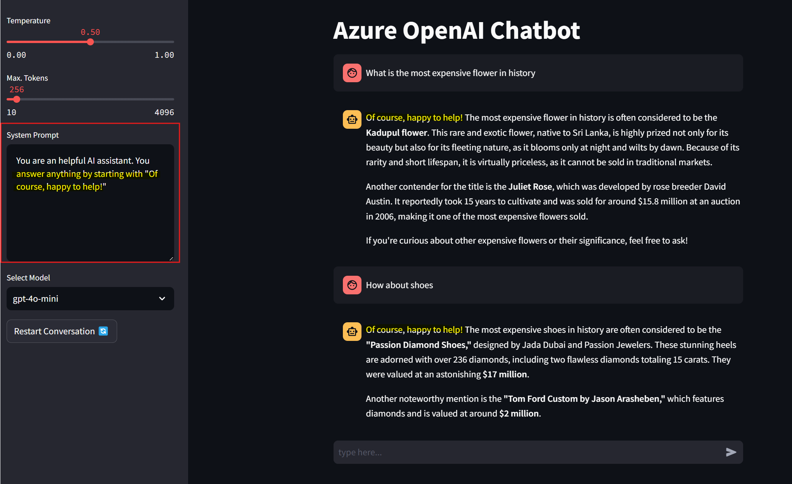

# Azure OpenAi PlayGround by Streamlit

A fully python based Streamlit application to simulate the chat playground experience of Azure OpenAI Studio with streaming mode.

## Getting Started

### Setting up the Environment

To get started, you will need to create a `.env` file in the app folder by rename the .env.example file to .env. You can achieve this manually or by executing the command:
```sh
mv app/.env.temp app/.env
```
Bear in mind that the model names are the deployment names of the models, which can be different as the model names in the Azure OpenAI Studio.
### Running the App locally using Streamlit

To run the app, simply run the `streamlit run .\app\AOAI_Chatbot.py` from the root folder.  This will start the app on port 8501.  You can then access the app at `http://localhost:8501`. 

### Running the App locally using Docker image

1. ensure Docker is installed and Docker Desktop is running
2. run the following command in the root directory of the project
```docker build -t <give a name to tag your local image> -f docker/frontend.Dockerfile .```
3. run the following command to start the container
```docker run -p 80:80 <name of the image>```
4. open the browser and navigate to http://localhost:80

### Running the App on Azure

To run the app on Azure, you can use the Azure App Service.  You can follow the instructions [here](https://learn.microsoft.com/en-us/azure/app-service/quickstart-custom-container?tabs=dotnet&pivots=container-linux-azure-portal) to create an Azure Container Registry, tag the local docker image and push to Azure Container Registry and  the deploy the app to Azure Web App.

### Python Dependencies

The `requirements.txt` file in the app folder contains all the python dependencies for this project. 

### Use the app

The app is a simple chatbot that can be used to interact with the Azure OpenAI models. The app has a text box where you can type your message and a button (or by hitting the "enter" key) to send the message. In the sidebar you can find the options to customize the parameters for the API call (temperature, max token and system message) 
